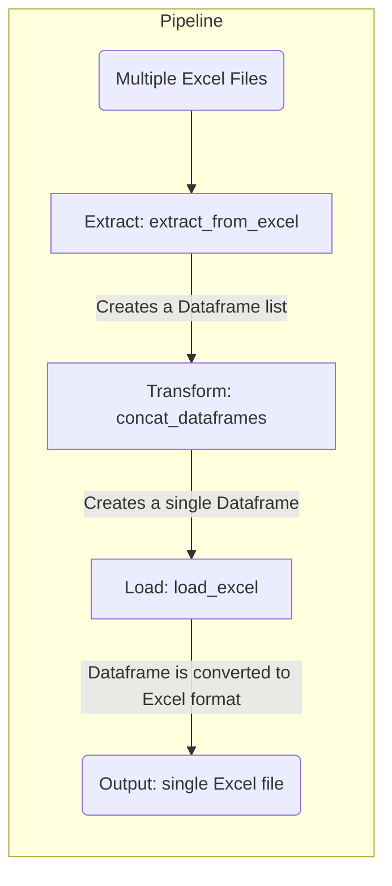

# ETL Pipeline - Documentation

This is a very simple ETL project focused on using some tools that can (and should) be used in any engineering and data analysis project.

This documentation serves to show what was developed in this project.
## Overview

This project involves creating fictitious data on employee absenteeism for a company that does not exist, with this data spread across several Excel files.

The pipeline combines all of these files into a single file, with the aim of creating a single source of data.
## Details

This is what happens when the pipeline is executed:

## Additional Information

If you want to know more details about the project, you can access its [repository](https://github.com/doegemon/data_project_standard_kit).
